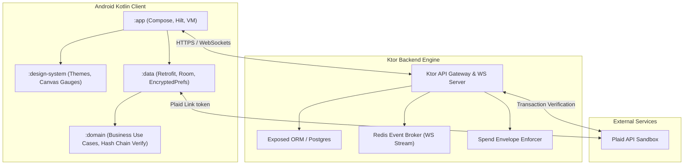

# TrustMesh: A Cryptographic Micro-Escrow and Spend-Policy Enforcement Protocol for Autonomous Agent-Based Commerce

## Abstract
As autonomous artificial intelligence agents increasingly participate in decentralized commerce, there is an urgent need for security and accountability frameworks that govern their financial activities. **TrustMesh** is a client-server control and cryptographic audit system designed to authorize, constrain, and audit autonomous AI procurement assistants. The platform comprises a multi-module Kotlin Android client application and a Kotlin Ktor backend server. TrustMesh enforces security bounds via transaction limits (Spend Envelopes) locked in micro-escrow holds, and guarantees historical transaction integrity via a cryptographically linked hash ledger.

---

## 1. System Architecture

TrustMesh utilizes a decoupled client-server architecture designed for high availability, transaction security, and real-time UPDATES.



### 1.1 Android Client Architecture
The mobile client follows **Clean Architecture** patterns separated into distinct Kotlin modules:
*   **`:domain`**: A pure Kotlin module holding domain entities (Agents, Transactions, Ledger Blocks), repository interfaces, and core business use cases. Specifically contains the validation logic for checking cryptographic hash integrity in transaction chains.
*   **`:data`**: Coordinates remote network endpoints via Retrofit + OkHttp, manages Plaid SDK bindings, and caches system state locally using a Room database. Room serves as the single source of truth for seamless offline operation. Cryptographic keys and JWT tokens are secured via `EncryptedSharedPreferences`.
*   **`:design-system`**: Houses the platform's design tokens (colors, typography) and custom Android UI components, including custom Canvas Gauges and Spider Charts for agent risk mapping.
*   **`:app`**: Handles UI presentation via Jetpack Compose, dependency injection bindings via Hilt, and UI state orchestration using MVVM ViewModels.

### 1.2 Ktor Backend Architecture
The server-side component is a high-performance REST and WebSocket API gateway built on the Ktor framework:
*   **Exposed ORM**: Handles transactional mapping over a PostgreSQL database with auto-generating schema configurations.
*   **Argon2id Hashing**: Secures user credential storage with parameterized work-factors.
*   **Redis Event Broker**: Drives live state changes to active WebSockets, enabling real-time UI updates on the Android client when autonomous agents initiate transactions.
*   **Spend Envelope Enforcer**: A state-machine business engine that evaluates incoming agent purchase requests against defined budgets and holds pending funds in escrow if they exceed standard authorization bounds.

---

## 2. Platform Visualizations

Here is a visual overview of the TrustMesh mobile application interface:

<p align="center">
  
</p>

The platform features a sleek, premium design system with a curated light palette, high-contrast structural cards, and responsive micro-animations to facilitate trust and operational transparency.

> [!NOTE]
> **To Attach Additional Screenshots:** Place your PNG/JPEG images into the `assets/screenshots/` directory, naming them descriptively, and embed them in the markdown using:
> ``

---

## 3. Cryptographic Chain & State Enforcement

TrustMesh ensures data auditability and tamper-resistance using a two-tier verification process:

### 3.1 Spend Envelope Enforcer State Machine
Autonomous agents request authorization before interacting with payment processors. The enforcer acts as a gateway:

$$\text{Request} \longrightarrow \text{Envelope Check} \longrightarrow \begin{cases} \text{Authorized} & \text{if } \text{Amount} \le \text{Threshold} \\ \text{Escrow Hold} & \text{if } \text{Amount} > \text{Threshold} \end{cases}$$

If placed in **Escrow Hold**, the client must explicitly sign a transaction release payload to release the escrowed funds.

### 3.2 Transaction Ledger Cryptographic Hash Chain
Each finalized transaction is recorded as a block in a localized hash chain:

$$H_i = \text{SHA-256}(BlockID \parallel TransactionData \parallel Timestamp \parallel H_{i-1})$$

The `:domain` module verifies the chain locally on the device by traversing the block history and checking that all hashes match sequentially, providing proof that no transaction logs have been modified in the database.

---

## 4. API Endpoints

The API is fully documented in the Swagger/OpenAPI format. Please refer to [`OPENAPI.yaml`](./OPENAPI.yaml) in the root directory for structural definitions. Below is a summary of major endpoints:

| Endpoint | Method | Authentication | Description |
| :--- | :--- | :--- | :--- |
| `/api/v1/auth/register` | `POST` | None | Registers a new user. |
| `/api/v1/auth/login` | `POST` | None | Authenticates user and returns JWT. |
| `/api/v1/accounts/link` | `POST` | JWT | Pairs bank credentials via Plaid Link Token. |
| `/api/v1/agents` | `GET` | JWT | Retrieves configured AI procurement agents. |
| `/api/v1/agents` | `POST` | JWT | Creates a new agent with defined spend constraints. |
| `/api/v1/transactions` | `GET` | JWT | Lists recent transactions and processing states. |
| `/api/v1/ledger` | `GET` | JWT | Returns the cryptographically chained block ledger. |
| `/api/v1/payments/create-order` | `POST` | JWT | Generates a Razorpay payment order for wallet funding. |
| `/api/v1/payments/verify` | `POST` | JWT | Cryptographically verifies HMAC-SHA256 signature and settles payment. |

---

## 5. Local Setup and Deployment Guide

### 5.1 API Credentials Configuration
1.  In the `android/` directory, create a `local.properties` file:
    ```properties
    PLAID_CLIENT_ID="your_plaid_client_id"
    PLAID_SECRET="your_plaid_secret_sandbox"
    ```
2.  In the `backend/` directory, configure a `.env` file or environment variables:
    ```bash
    PLAID_CLIENT_ID=your_plaid_client_id
    PLAID_SECRET=your_plaid_secret_sandbox
    JWT_SECRET=super-secure-jwt-secret-key-12345678
    ```
    *Note: Plaid Sandbox credential checks authenticate with Username `user_good` and Password `password_good`.*

### 5.2 Launching the Server Backend
Using Docker and Docker Compose, launch the multi-container environment (PostgreSQL + Redis + Ktor Application Server):
```bash
docker-compose up --build
```
This binds:
*   PostgreSQL on port `5432`
*   Redis on port `6379`
*   Ktor HTTP API on port `8080` (Verify via `http://localhost:8080/api/v1/health`)

### 5.3 Building the Android Client
1.  Open the `android/` directory in Android Studio.
2.  Let Gradle index and sync dependencies.
3.  Deploy on an emulator or active hardware.
    *Note: The Android client routes requests to the local host machine using loopback address `10.0.2.2:8080`.*

---

## 6. Testing

TrustMesh contains JVM unit tests to verify system logic.

### 6.1 Android Domain Ledger Verification Tests
Test hash-chain calculation and signature checks:
```bash
cd android
./gradlew :domain:test
```

### 6.2 Backend Route Validation Tests
Test Ktor endpoint configurations:
```bash
cd backend
./gradlew test
```
